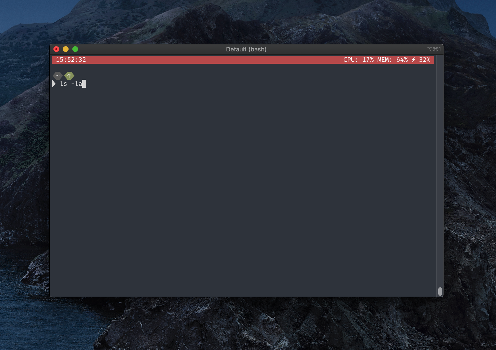

# Shox: Terminal Status Bar

[](https://travis-ci.org/liamg/shox)

A customisable terminal status bar with universal shell/terminal compatibility.  



## Installation

```bash
curl -s "https://raw.githubusercontent.com/liamg/shox/master/scripts/install.sh" | bash
```

## Configuration

The shox config file should be created at `$XDG_CONFIG_HOME/shox/config.yaml`, which is usually `~/.config/shox/config.yaml`. You can alternatively create it at `~/.shox.yaml`

The config file looks like the following:

```yaml
shell: /bin/bash
bar:
    format: "{time}||CPU: {cpu} MEM: {memory}"
    colours: 
      bg: red
      fg: white
    padding: 0
```

Shox will use your `SHELL` environment variable to determine the shell to run if a shell is not specified in the config file, but if your `SHELL` is set to shox, it'll default to `/bin/bash` to prevent a horrible recursive mess.

### Bar Configuration

Bar configuration is done using a simple string format. Helpers are encased in braces e.g. `{time}`, alignment is done using pipes (see below), and any other text will be written to the bar.

#### Alignment

You can use pipes to align content within the status bar. All content before the first pipe will be aligned to the left, all content between the first and second will be centre aligned, and all content after the second pipe will be right aligned.

For example, to display a bar that centre aligns the time, you could use `|{time}|` 

#### Colours

The following colours are available: `black`, `white`, `red`, `green`, `yellow`, `blue`, `magenta`, `cyan`,  `darkgrey`, `lightgrey`, `lightred`, `lightgreen`, `lightyellow`, `lightblue`, `lightmagenta`, `lightcyan`.

#### Helpers

Helpers create dynamic output in your status bar. You can use one by adding it to your bar format config. The following is a list of available helpers.

| Helper  | Description                   | Example Config | Example Output |
|---------|-------------------------------|----------------|----------------|
| time    | Show current time             | {time}         | 11:58:17       |
| cpu     | Show current CPU usage        | {cpu}          | 20%            |
| memory  | Show current memory usage %   | {memory}       | 20%            |
| battery | Show current battery charge % | {battery}      | 20%            |

## Why?

I frequently needed a way to have a quick overview of several things without cramming them into my PS1, and to update those things dynamicly.

## How does it work?

Shox sits between the terminal and your shell and proxies all data sent between them. It identifies ANSI commands which contain coordinates and dimensions and adjusts them accordingly, so that the status bar can be drawn efficiently without interfering with the shell and it's child programs.
